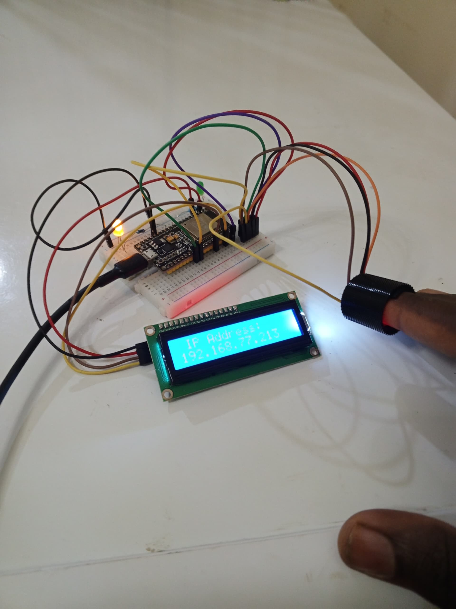
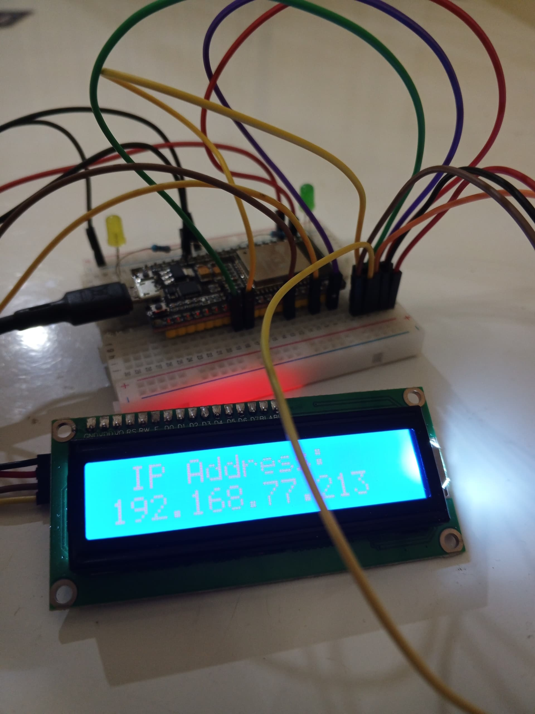
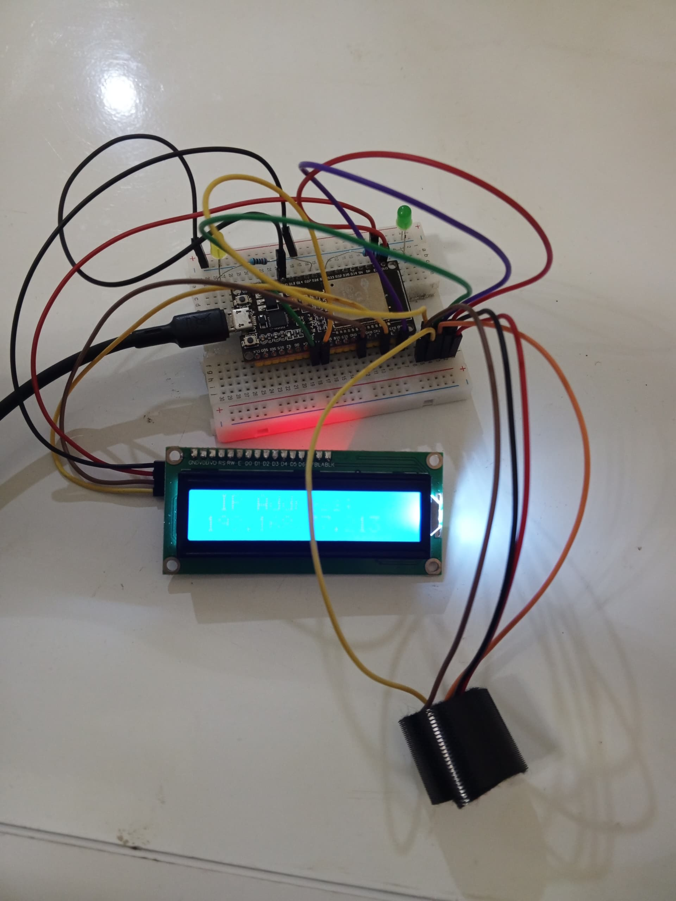
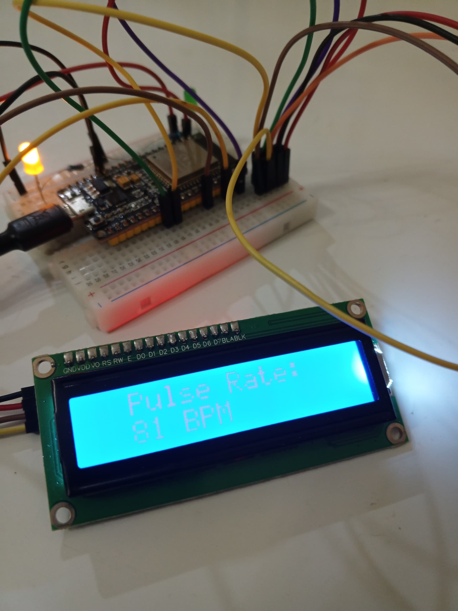

# IoT Pulse Monitor

## Project Overview
The IoT Pulse Monitor is a health monitoring device designed to measure and display heart rate (BPM) in real-time using a MAX30102 sensor and an ESP32 microcontroller. The device provides both local display via an LCD screen and remote monitoring through a web server, making it suitable for various healthcare and fitness applications.

## Features
- **Real-time Heart Rate Monitoring**: Measures and displays BPM using the MAX30102 sensor.
- **Local Display**: Shows heart rate data on a 1602 LCD screen.
- **Remote Monitoring**: Hosts a web server to display heart rate data on any device connected to the same network.
- **WiFi Connectivity**: Uses ESP32's built-in WiFi capabilities to broadcast data.
- **JSON Data Transmission**: Sends heart rate data in JSON format for easy integration with applications.
- **Flutter App Compatibility**: Includes code snippets for connecting a Flutter app to the web server for mobile monitoring.

## Components Used
1. **GY-MAX30102 Heart Rate/Oxygen Sensor Module**
2. **1602 LCD Green Display**
3. **I2C LCD Interface**
4. **Jumper Wires**
5. **LEDs and Resistors**
6. **ESP32 WROOM-32D Development Board**
7. **Adaptable Box**

## Screenshots

## Bill of Materials
| S/N | Component                                      | Price (₦) |
|-----|-----------------------------------------------|-----------|
| 1   | GY-MAX30102 Sensor Module                     | 4,000     |
| 2   | 1602 LCD Green                                | 3,700     |
| 3   | I2C LCD Interface                             | 1,600     |
| 4   | Jumper Wires                                  | 1,200     |
| 5   | LEDs                                          | 200       |
| 6   | Resistors                                     | 200       |
| 7   | ESP32 WROOM-32D Development Board             | 12,000    |
| 8   | Adaptable Box                                 | 1,500     |
| 9   | Delivery Fees                                 | 5,000     |
| 10  | Transport                                     | 5,000     |
|     | **Total**                                     | **34,400**|

## Setup Instructions
### Hardware Setup
1. Connect the MAX30102 sensor to the ESP32:
    - **Vin**: 3.3V
    - **GND**: GND
    - **SDA**: Pin 21 (default)
    - **SCL**: Pin 22 (default)
2. Connect the LCD to the ESP32 via the I2C interface.
3. Assemble the circuit in an adaptable box for portability.

### Software Setup
1. **Arduino IDE**:
    - Install the required libraries:
        - `MAX30105`
        - `WiFi`
        - `AsyncTCP`
        - `ESPAsyncWebSrv`
        - `Arduino_JSON`
        - `heartRate`
        - `Wire`
        - `LCD_I2C`
    - Upload the provided Arduino code to the ESP32.
2. **Flutter App** (Optional):
    - Use the `eventflux` and `permission_handler` libraries to connect to the ESP32 web server.
    - Implement the provided Flutter function to receive and display heart rate data.

## Project Operation
1. Power on the device and wait for the ESP32 to connect to WiFi.
2. The LCD will display the assigned IP address.
3. Place your finger on the MAX30102 sensor for heart rate measurement.
4. The LCD will show the real-time BPM.
5. Connect any device to the ESP32's web server using the displayed IP address to view the heart rate data remotely.

## Applications
- **Remote Patient Monitoring**: Track patients' heart rates in real-time.
- **Fitness Tracking**: Monitor heart rate during workouts.
- **Chronic Disease Management**: Continuous monitoring for conditions like heart disease.
- **Elderly Care**: Remote health monitoring for seniors.
- **Wearable Health Tech**: Integration into smartwatches or fitness bands.
- **Research and Clinical Trials**: Data collection for cardiovascular studies.
- **Emergency Services**: Quick heart rate assessment in critical situations.
- **Sports Performance**: Optimize training and recovery strategies.

## Conclusion
The IoT Pulse Monitor combines traditional heart rate sensing with modern IoT technology to provide a versatile and efficient health monitoring solution. Its real-time data transmission and remote accessibility make it a valuable tool for both personal health management and professional medical care. As IoT technology advances, the potential applications of this device will continue to expand, offering even more comprehensive healthcare solutions.

## Contributors
- **Group 5**  
  Class 23
  Department of Electrical and Electronics Engineering,  
  Federal University of Technology, Akure.  
  September 2024

For more details, refer to the [full project report](https://docs.google.com/document/d/1Xa3xxTNzsMhiRhIIJztyjDZnTmOi-p5Cg0W6Hx_RyCM/edit?usp=sharing).

